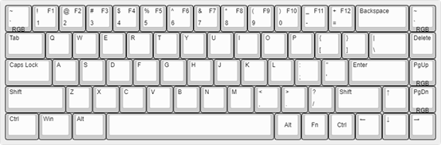

<html xmlns:v="urn:schemas-microsoft-com:vml"
xmlns:o="urn:schemas-microsoft-com:office:office"
xmlns:w="urn:schemas-microsoft-com:office:word"
xmlns:m="http://schemas.microsoft.com/office/2004/12/omml"
xmlns="http://www.w3.org/TR/REC-html40">

<head>
<meta http-equiv=Content-Type content="text/html; charset=gb2312">
<meta name=ProgId content=Word.Document>
<meta name=Generator content="Microsoft Word 15">
<meta name=Originator content="Microsoft Word 15">
<link rel=File-List href="FK680使用说明.files/filelist.xml">
<link rel=Edit-Time-Data href="FK680使用说明.files/editdata.mso">
<link rel=themeData href="FK680使用说明.files/themedata.thmx">
<link rel=colorSchemeMapping href="FK680使用说明.files/colorschememapping.xml">
</head>

<body lang=ZH-CN link=blue vlink="#954F72" style='tab-interval:21.0pt;
word-wrap:break-word;text-justify-trim:punctuation'>

FK680使用说明<o:p></o:p>

&nbsp;&nbsp;这是一把亚克力堆叠的68键键盘。包装内含有键盘主体，一根Type-C数据线，一个拔键拔轴器，一个螺丝刀，8个脚垫，收货时记得检查配件是否齐全。<o:p></o:p>

  

&nbsp;&nbsp;（现已适配VIA，配置文件已经放到群947413266文件中，大家可以根据自己的需求改键。后面这段不用看了）方法是将.json文件上传到<a href="https://kbfirmware.com/">https://kbfirmware.com/</a>或者<a href="http://qmkeyboard.cn/">http://qmkeyboard.cn/</a> &nbsp;点击KEYMAP页编辑层和键值，编辑完成后点击COMPILE页中的Download.hex按钮下载固件。下载好固件后使用QMK Toolbox刷入，重置按钮在键盘底部。<o:p></o:p>

QMK Toolbox链接<a
href="https://github.com/qmk/qmk_toolbox/releases">https://github.com/qmk/qmk_toolbox/releases</a>
<o:p></o:p>

&nbsp;&nbsp;默认值是
</v:shape><![endif]--><![if !vml]><![endif]><o:p></o:p>

由于我们的定位板设计的比较紧，客制化钢板卫星轴可能需要用力才能卡进去。但要注意，装轴时不要大力出奇迹怼坏轴座。<o:p></o:p>

拆解和组装<o:p></o:p>

&nbsp;&nbsp;&nbsp; 键盘一共使用了6层亚克力，第1-5层在左上角标有序号。5mmPC定位板在第0层和第2层之间，PCB在第2层和第4层之间。建议将键盘倒扣着组装和拆解。（发货时是组装好的）<o:p></o:p>

其他的一些文件可以去群里找，有不懂的大家也可以互相帮助，有任何建议也可以在群里说。<o:p></o:p>

</body>

</html>
